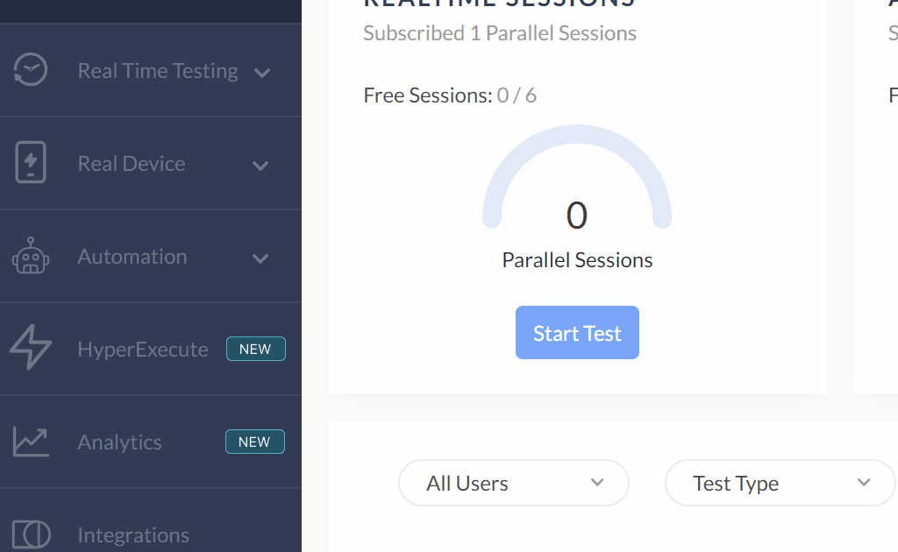
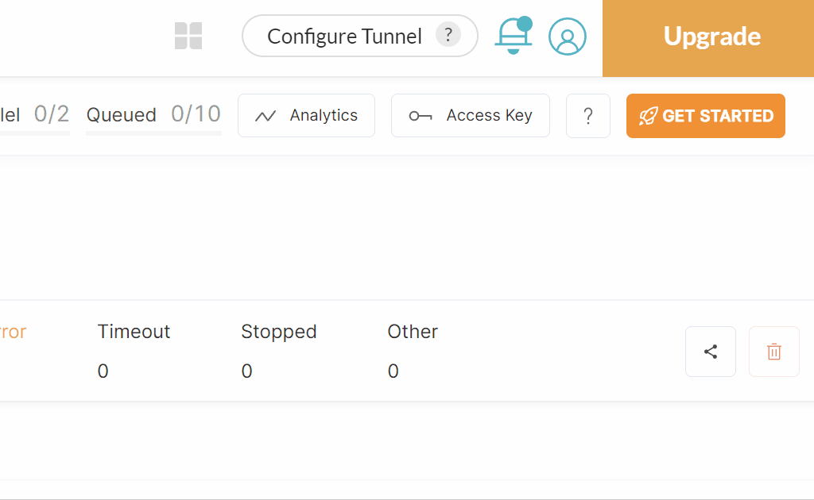

# UX Playwright testing with Lambdatest | Installation

Before using do `npm install` in terminal while being in the project folder.

Create .env file in the root of this project and add following contents to it:
```conf
LT_USERNAME="YOUR USER GOES HERE"
LT_ACCESS_KEY="YOUR ACCESS KEY GOES HERE"
```
Navigate to automation dashboard at Lambdatest and select **Builds**


Copy your username and access key and replace the place holder strings in the
  .env file with them.


After all this you should be able to run the tests in this project.

[Back to README](../README.md)
